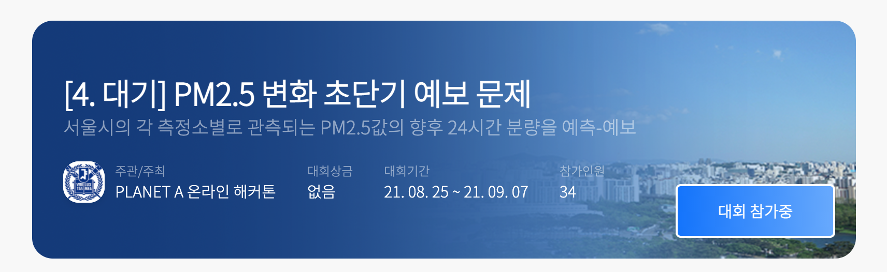

# SNU PlanetA competition
> 지구과학 데이터를 활용해 AI 모델을 개발하는 task 4개가 주어졌습니다.   
> 총 참가팀은 35팀이며, 제가 속한 팀 풀스톤은 [task2: 10위], [task4: 9위]를 각각 기록했습니다.

- [Competition link](http://aifactory.space/page/SNUPLANETA)

저는 위 대회에 참가하여 데이터 로드, 전처리, EDA, feature engineering 까지 전반을 직접 수행했습니다. 

아래 표에는 제가 담당한 task 2 & 4 Jupyter Notebook 링크와 간단한 설명을 기입했습니다. 구체적인 코드는 링크의 주피터노트북을 확인해주세요.

| 태스크 개요 | 링크 |  설명|
| :----: | :----: | :----: |
|지각 두께 분류하기 | [task2](https://github.com/minji2744/PlanetA/blob/main/task2_classifying_arc_thickness.ipynb) | scikit-learn 라이브러리의 classification model을 활용해서 classification task 수행 |
|24시간 후 미세먼지 예측하기 | [task4](https://github.com/minji2744/PlanetA/blob/main/task4_forecasting_pm25.ipynb) |  time series forecasting tutorial from tensorflow([링크](https://www.tensorflow.org/tutorials/structured_data/time_series))를 참고하여 LSTM 레이어를 적용한 시계열 예측 모델 구현 |